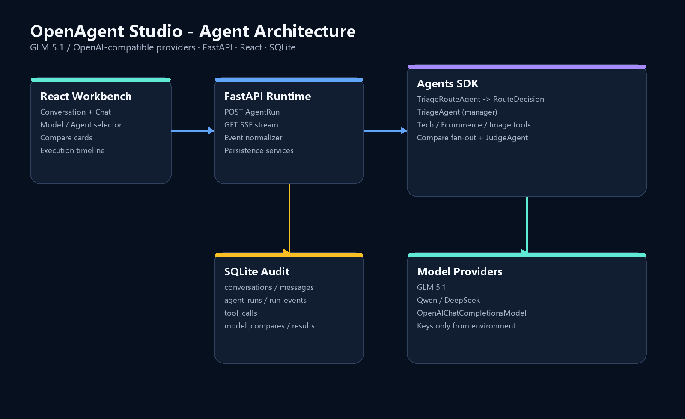

# OpenAgent Studio

OpenAgent Studio 是一个面向学习、实战和面试展示的多模型智能体工作台。它不是普通聊天壳：用户可以切换模型和 Agent 模式，观察路由、专家协作、工具调用、并发模型评测与 Judge 评分的完整执行过程，并在 SQLite 中回放运行证据。

当前文本智能体由 GLM 5.1 等 OpenAI-compatible 模型驱动，不需要 OpenAI API Key。项目使用 OpenAI Agents SDK 负责 Agent loop、工具调用和 agents-as-tools 编排，并关闭默认 OpenAI tracing。



## 已完成功能（Day 1-30）

- React + TypeScript + Vite 三栏工作台，支持深浅主题和 Markdown。
- FastAPI + SQLAlchemy + SQLite 会话、消息、运行、事件和工具调用持久化。
- 本地用户注册/登录、scrypt 密码哈希、HttpOnly 会话、登录失败验证码和用户数据隔离。
- AgentRun + SSE 流式输出，统一事件协议和右侧执行时间线。
- `AppConversationSession` 用现有 `messages` 表实现 Agents SDK Session 协议，支持跨轮记忆、完整工具上下文和旧消息兼容。
- GeneralAgent、TechAgent、EcommerceAgent 和图片提示词规划 ImageAgent。
- Auto 模式：结构化 `RouteDecision` + 规则降级，自动识别 general / tech / ecommerce / image / compare。
- TriageAgent manager 模式：通过 `Agent.as_tool()` 调用专家并保留最终答复控制权。
- 模型选择器：从 `/api/models` 加载安全的模型能力信息，请求通过 `primary_model_id` 指定模型，消息记录实际模型。
- Compare 模式：并发运行 2-3 个模型，单模型失败隔离，结果并排展示并持久化。
- ModelJudgeAgent：按准确性、结构、可执行性、表达、推荐度五维评分并推荐胜出模型；结构化输出失败时规则降级。
- 面试演示脚本、架构图、运行时序图和 Day 24-30 回归测试。

## 技术栈

- 前端：React 19、TypeScript、Vite、React Markdown。
- 后端：Python 3.12、FastAPI、OpenAI Agents SDK、OpenAI Python SDK。
- 数据库：SQLite + SQLAlchemy 2.0 + aiosqlite。
- 模型：GLM 5.1、Qwen、DeepSeek 等 OpenAI-compatible Chat Completions 端点。
- 流式协议：SSE（EventSource）。
- 记忆：Agents SDK 自定义 Session Adapter；`messages.sdk_item_json` 保存原始 SDK item，`is_visible` 隔离内部工具记忆与聊天展示。

## 快速启动

### 1. 配置环境变量

复制 `.env.example` 为 `.env`，只填写你实际使用的模型供应商 Key。数据库只保存环境变量名称，不保存 Key 明文。

当前种子配置使用：

- `GLM_API_KEY`：GLM 5.1。
- `NVIDIA_KEY`：NVIDIA API 上配置的 Qwen / DeepSeek 模型。

如使用其他 OpenAI-compatible 服务，请调整 `backend/app/db/seed.py`，或直接维护 `model_configs` 表中的端点和模型能力。

### 2. 启动后端

```powershell
uv sync
uv run uvicorn backend.app.main:app --reload --host 127.0.0.1 --port 9099
```

验证：打开 `http://127.0.0.1:9099/api/health` 或 `http://127.0.0.1:9099/docs`。

### 3. 启动前端

```powershell
cd frontend
npm install
npm run dev
```

打开 `http://127.0.0.1:5173`。Vite 会把 `/api` 代理到 `http://127.0.0.1:9099`。

首次打开时先注册用户名和至少 8 位密码。升级旧数据库时，第一个注册用户会自动接管原有历史会话；之后每个账号只能访问自己的会话、消息和 AgentRun。

## 核心接口

| 方法 | 路径 | 用途 |
| --- | --- | --- |
| POST | `/api/auth/register` | 注册并创建登录会话 |
| POST | `/api/auth/login` | 登录；连续失败 3 次后要求验证码 |
| GET | `/api/auth/captcha` | 获取一次性图形验证码 |
| GET | `/api/auth/me` | 获取当前登录用户 |
| POST | `/api/auth/logout` | 退出并撤销当前会话 |
| GET | `/api/models` | 获取可用模型和安全的能力信息 |
| POST | `/api/conversations` | 创建会话 |
| GET | `/api/conversations/{id}/messages` | 回看消息 |
| POST | `/api/agent-runs` | 创建普通、Auto 或 Compare 运行 |
| GET | `/api/agent-runs/{id}/stream` | SSE 执行与事件推送 |
| GET | `/api/agent-runs/{id}/events` | 回放运行时间线 |
| GET | `/api/agent-runs/{id}/tool-calls` | 查询工具调用审计 |
| GET | `/api/agent-runs/{id}/compare-results` | 查询模型对比和 Judge 结果 |

创建 Compare Run 示例：

```json
{
  "conversation_id": "conversation-id",
  "content": "为智能体工作台写一段活动文案",
  "agent_mode": "compare",
  "primary_model_id": "judge-model-config-id",
  "compare_model_ids": ["model-config-a", "model-config-b"]
}
```

## Auto 路由与多 Agent 协作

Auto 模式先由 `TriageRouteAgent` 返回结构化 `RouteDecision`。Tech、Ecommerce 和 Image 请求由 TriageAgent 以 manager 模式调用专家 Agent tool，因此右侧会看到 `route.decision -> tool.called -> tool.output -> run.completed`。Compare 请求进入独立 fan-out + Judge 流水线。

如果第三方模型不支持结构化输出，系统会使用可解释的关键词规则路由；如果 Judge 结构化评分失败，则使用规则评分。前端和事件数据会明确显示 `source` 或 `fallback_used`，不会伪装为模型评分。

## 验证命令

```powershell
# 后端语法和 Day 24-30 回归测试
.\.venv\Scripts\python.exe -m compileall -q backend
.\.venv\Scripts\python.exe -m unittest discover -s backend/tests -v

# 前端类型检查与生产构建
cd frontend
npm run build
```

## 演示资料

- [架构说明](./docs/architecture.md)
- [5-8 分钟演示脚本](./docs/demo-script.md)
- [Day 24-30 开发记录](./docs/dev-log.md)
- [30 天开发计划](./docs/OpenAgent_Studio_30天开发计划.docx)
- [需求文档](./docs/基于%20OpenAI%20Agents%20SDK%20的面试型智能体工作台需求文档.pdf)

## 后续扩展

Day 31 以后可继续接入真实 FLUX 图片生成与资产画廊、Guardrails、Human-in-the-loop 审批、服务端取消、Docker 部署和统一评估集。当前 ImageAgent 只负责图片方案和提示词，不会声称已经生成图片。
