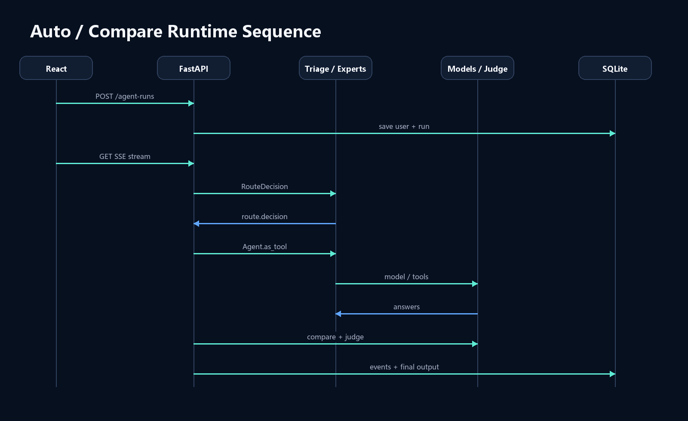

# OpenAgent Studio 架构说明

OpenAgent Studio 使用 React + FastAPI + SQLite 构建工作台外壳，以 OpenAI Agents SDK 运行 Agent loop，并通过 OpenAI-compatible Chat Completions 接入 GLM 5.1、Qwen、DeepSeek 等第三方模型。项目不依赖 OpenAI API Key，SDK tracing 已关闭。

## 运行主链路

1. React 调用 `POST /api/agent-runs` 创建运行，保存用户消息和 `agent_runs`。
2. 前端通过 EventSource 订阅 `GET /api/agent-runs/{run_id}/stream`。
3. 手动模式直接创建 General/Tech/Ecommerce/Image Agent；Auto 模式先生成 `RouteDecision`。
4. TriageAgent 以 manager 身份调用专家 Agent tool，最终答复控制权仍由 TriageAgent 保留。
5. SDK 原始事件被规范化为 SSE 事件并同步写入 `run_events`；工具调用写入 `tool_calls`。
6. Compare 模式并发运行 2-3 个模型，结果写入 `model_compares` 与 `model_compare_results`，最后由 ModelJudgeAgent 输出评分。

## 关键设计选择

- 第三方模型统一使用 `OpenAIChatCompletionsModel`，模型端点、环境变量名和能力由数据库配置。
- 对话状态由应用层 SQLite 管理，避免不同 Provider 的服务端会话语义不一致。
- SSE 只承担后端到前端的事件推送；审批等双向控制留到后续 WebSocket/HITL 阶段。
- Triage 的结构化输出失败时使用可解释的规则路由；Judge 失败时使用规则评分，保证演示链路可降级。
- 候选模型独立失败，单个失败不会中断其他模型和 Judge 对成功结果的评审。

## 事件协议

主要事件包括：`run.started`、`route.started`、`route.decision`、`agent.updated`、`tool.called`、`tool.output`、`token.delta`、`compare.model.started`、`compare.model.completed`、`compare.model.failed`、`judge.started`、`judge.completed`、`run.completed`、`run.error`。

## 架构图

